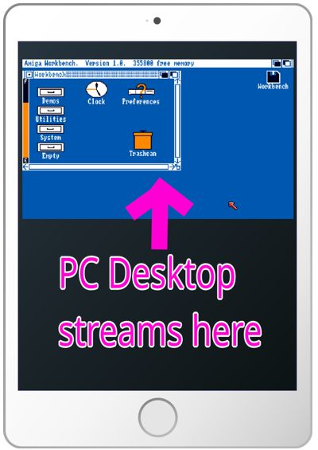
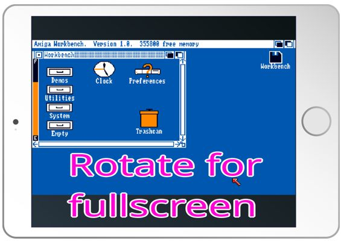
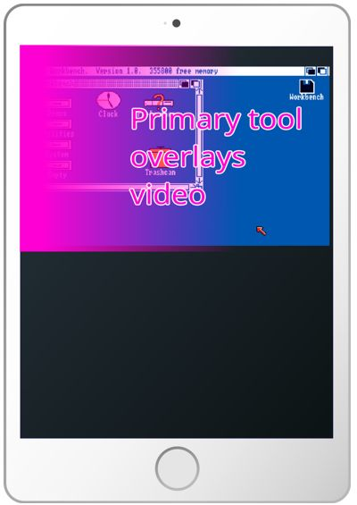
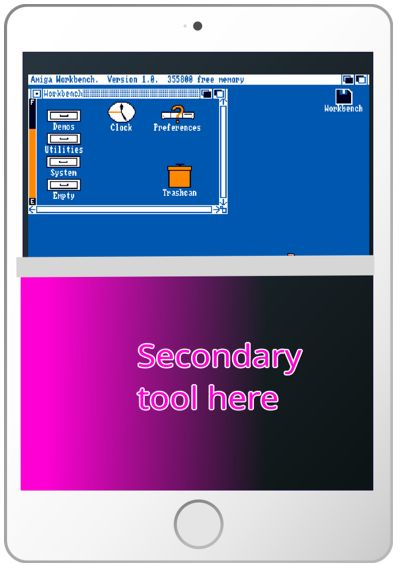
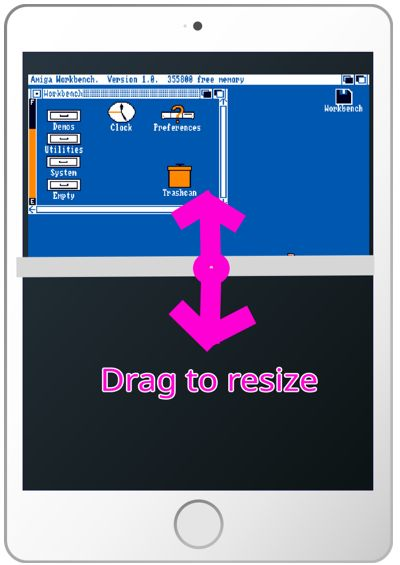
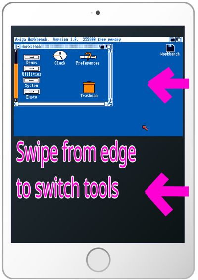
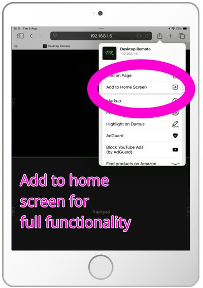

# Inara: the Desktop Remote Mobile Companion

[](https://ai-declaration.md)

Connect your mobile device wirelessly to your PC and use it as:

| Feature               | Linux Wayland  | Linux X11 | Windows | Macos |
|-----------------------|----------------|-----------|---------|-------|
| Trackpad              | ✅             | ✅        | ❌      | ❌    |
| Graphics tablet       | ✅             | ✅        | ✅      | ❌    |
| Display mirror        | ✅ (Intel/AMD) | ✅        | ✅      | ❌    |
| ~~Camera~~            | ❌             | ❌        | ❌      | ❌    |
| ~~Microphone~~        | ❌             | ❌        | ❌      | ❌    |
| ~~Keyboard~~          | ❌             | ❌        | ❌      | ❌    |
| ~~Clipboard~~         | ❌             | ❌        | ❌      | ❌    |
| ~~Extra display~~     | ❌             | ❌        | ❌      | ❌    |
| ~~Game controller~~   | ❌             | ❌        | ❌      | ❌    |
| ~~File send/receive~~ | ❌             | ❌        | ❌      | ❌    |

Tested desktops: Gnome Wayland, XFCE X11, Windows 11.

Tested tablet software: Gimp, Krita (Windows: enable Windows Ink and restart)

Tested mobile devices: iPhone, iPad + Apple Pencil.

## Compared to Weylus

[Weylus](https://github.com/electronstudio/WeylusCommunityEdition) is a program for simulating a graphics tablet
and mirroring the display.  Inara explores some _different_ methods of implementing those features,
which may not necessarily be better!

Inara uses WebRTC connections. The underlying protocol is UDP rather than TCP which _may_ (or may not)
have lower latency.

Inara mirrors the display using ffmpeg's kmsgrab, which _may_ (or may not) work better on Wayland (although doesn't
work at all on Nvidia systems).

Inara uses hardware accelerated VAAPI/CUDA encoding by default.  (Weylus says it has this, but it doesn't appear to be
finished.)

Inara is written in Go rather than Rust.

Inara simulates other devices besides just a graphics tablet.


## Install

Download latest packages from [releases](https://github.com/electronstudio/desktop_remote_mobile_companion/releases).
(May be newer than links below.)

### Windows

Download [zip file](https://github.com/electronstudio/desktop_remote_mobile_companion/releases/download/v0.8.10/inara-windows-x86_64-0.8.10.zip) and unzip.

### Ubuntu, Debian, Mint

Download the [deb package](https://github.com/electronstudio/desktop_remote_mobile_companion/releases/download/v0.8.10/inara_0.8.10-1_amd64.deb), then install:

    cd ~/Downloads
    sudo apt install ./inara_0.8.10-1_amd64.deb

### Arch, CachyOS

Install from [AUR](https://aur.archlinux.org/packages/inara), e.g.:

	paru -S inara --noconfirm

### Other Linux

Download the [static binary tarball](https://github.com/electronstudio/desktop_remote_mobile_companion/releases/download/v0.8.10/inara-linux-x86_64-0.8.10.tar.xz) and untar.

OR

Run the [static binary installer](https://github.com/electronstudio/desktop_remote_mobile_companion/releases/download/v0.8.10/inara-linux-x86_64-0.8.10.installer.run). This command downloads and runs it:

```bash
curl -sSLfO https://github.com/electronstudio/desktop_remote_mobile_companion/releases/download/v0.8.10/inara-linux-x86_64-0.8.10.installer.run && 
chmod +x inara-linux-x86_64-0.8.10.installer.run && 
./inara-linux-x86_64-0.8.10.installer.run && 
rm inara-linux-x86_64-0.8.10.installer.run
```

### Note

On Intel GPU systems the full Intel drivers are required.  Install them with:

    sudo apt install intel-media-va-driver-non-free
    
If your OS firewall blocks connections by default (e.g. CachyOS) you will need to open a port, e.g.:

    sudo ufw allow 8080

## Run

For the GUI version, run:

```bash
inara_gui
```

If you installed a Linux package, it will appear on your start menu.  On Windows there is no installer, you just
double click `inara_gui.exe`.

You will see a window with options.  Click the `Start` button.  If it doesn't work, try clicking `Fix permissions`.

The first time it runs, a self-signed certificate is created in your user cache
directory (`$HOME/.cache/inara` on Linux).  Delete it to re-generate if
you have any certificate problems. (Also try using private browser tab.)

Inara will print a URL and also a QR code for that URL, e.g. `https://192.168.1.150:8080`. 
Open this URL on your mobile device.

On first run you must accept the self-signed certificate on the device and refresh the page.

Then video streaming will start:



 

  

The tools available so far are: graphics tablet, trackpad, log output.

  



### Nvidia on Linux

Wayland is not supported by Nvidia on Linux.  Use X11 and specify `--video-source x11grab`

## Build

### Arch (CachyOS, Artix, etc) Linux

Install from AUR: https://aur.archlinux.org/packages/inara-git e.g.

```bash
paru inara-git
```

### Debian, Ubuntu etc

```bash
sudo apt install libavcodec-dev libavfilter-dev libavformat-dev \
        libavutil-dev libavdevice-dev libdrm-dev libgl1 libegl1 libwayland-client0 libwayland-cursor0 \
        libwayland-egl1 libx11-6 libxcursor1 libxrandr2 libxinerama1 libxi6
make
```

## Advanced (Linux)

If you can't see your mouse pointer, you need to disable hardware cursor:

```bash
echo "MUTTER_DEBUG_DISABLE_HW_CURSORS=1" | sudo tee /etc/environment
echo "KWIN_FORCE_SW_CURSOR=1" | sudo tee /etc/environment
echo "WLR_NO_HARDWARE_CURSORS=1" | sudo tee /etc/environment
sudo reboot
```

By default when the tablet tool is active it keeps the tablet 'hovering'
which prevents use of a mouse until you switch away from the tool.
This is required by some software such as Gnome.  But you can disable it:

    inara --dont-grab-mouse

The Linux packages install a systemd *user* service (`/usr/lib/systemd/user/inara.service`) that runs the
headless `inara` server.  To have the server start automatically every time you log in, enable it:

    systemctl --user enable --now inara.service

Check its status/output with `systemctl --user status inara` / `journalctl --user -u inara`.  Disable with:

    systemctl --user disable inara

Stop with:

    systemctl --user stop inara


## Security (Linux)

To act as a trackpad or tablet, Inara requires access to `uinput`.  You have three options
for getting this:
1. Run with `sudo`. (You'll be prompted to do this if necessary.)
2. Add your user to the uniput group, then reboot. (This has the downside of granting access to every other program on your system.):

   `sudo usermod -aG uinput $USER`

3. Grant a more limited set of permissions to just this program permanently:

   `sudo /sbin/setcap cap_sys_admin,cap_dac_override,cap_setpcap=p /path/to/inara`

To capture video, Inara requires `sys_admin` permission.  Options for this:
1. Disable video with `inara --video-source none`
2. Run with `sudo`.
3. Grant a more limited set of permissions to the program permanently:

   `sudo /sbin/setcap cap_sys_admin,cap_dac_override,cap_setpcap=p /path/to/inara`

If you installed the Debian or Arch package, setcap will be done automatically.  If you downloaded the binary
tarball, run `inara_gui` and press 'fix permissions' to run setcap.
